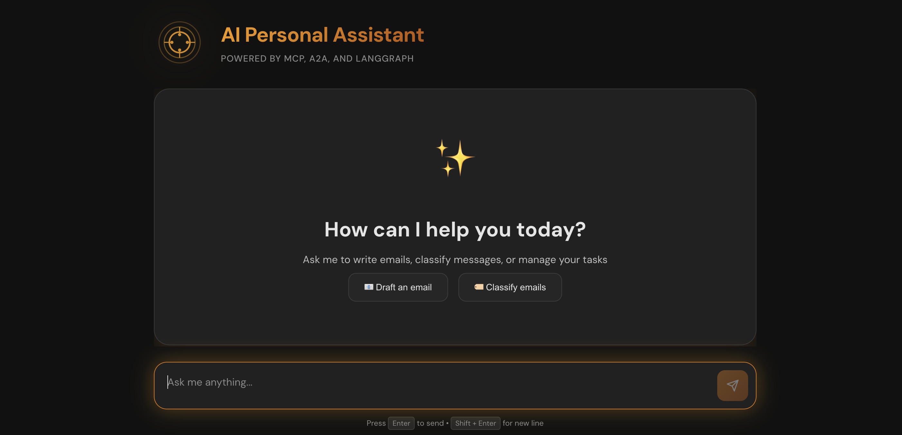
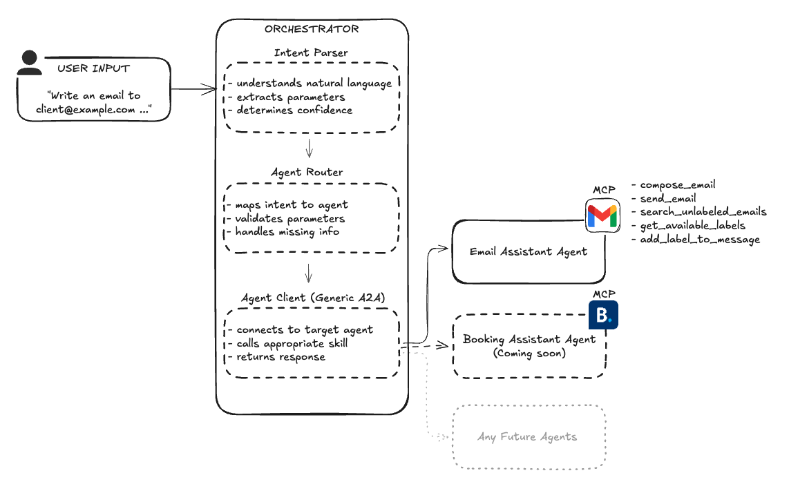
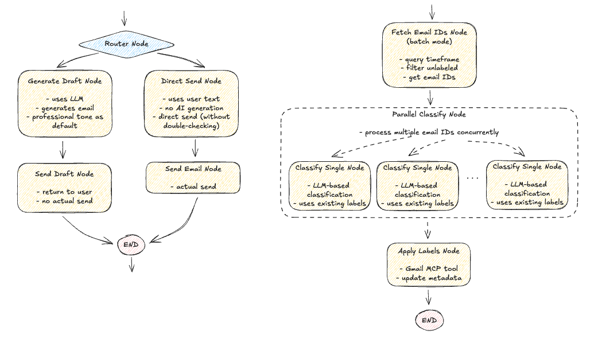

<div align="center">
  <h1>AI Personal Assistant</h1>
  <p>A modular AI assistant that manages emails using natural language — built on A2A and MCP open protocols.</p>
  <p>
    
    
  </p>
  <p>
    
    
    
  </p>
</div>

---

## Table of Contents

1. [Features](#features)
2. [Architecture](#architecture)
3. [Tech Stack](#tech-stack)
4. [Getting Started](#getting-started)
   - [Prerequisites](#prerequisites)
   - [Gmail OAuth Setup](#gmail-oauth-setup)
   - [Installation](#installation)
   - [Configuration](#configuration)
   - [Running the System](#running-the-system)
5. [Protocols Deep Dive](#protocols-deep-dive)
   - [A2A Protocol](#agent-to-agent-protocol-a2a)
   - [MCP](#model-context-protocol-mcp)

---

## Features

### Email Assistant
- **Draft & send emails** — AI-generated drafts with tone control, or direct send
- **Batch classify emails** — categorize inbox emails in parallel using LLM
- **Natural language interface** — "Write a professional email to client@example.com about the project update"

### Subscription Manager
- **Auto-detect subscriptions** — scans your inbox using only From + Subject (no body reading), classifies with LLM
- **Auto-unsubscribe** — one-click RFC 8058 unsubscribe for supported senders; GET-based unsubscribe for others
- **Manual unsubscribe** — direct "View in Gmail →" link for senders without machine-readable unsubscribe headers
- **Confidence scoring** — shows how likely an email is a subscription (0–100%) for ambiguous senders
- **Email categorization** — moves emails from unsubscribed senders to Gmail's Promotions tab automatically
- **Live polling** — detects new subscriptions every 5 minutes in the background

---

## Architecture

```
UI (React/Vite, :3000)
        │  A2A
        ▼
Orchestrator (:9010)          ← parses intent, routes to agents
        │  A2A
        ▼
Email Assistant (:8002)       ← LangGraph workflows (write, classify, subscriptions)
        │  MCP (stdio)
        ▼
Gmail MCP Server              ← wraps Gmail API, exposes tools
        │
        ▼
Gmail API
```

<div align="center">
  
  <br/><br/>
  <a href="./images/architecture.png">
    
  </a>
  <br/>
  <em>Figure 1 — System architecture overview</em>
  <br/><br/>
  <a href="./images/email_graphs.png">
    
  </a>
  <br/>
  <em>Figure 2 — Email LangGraph workflows (writing and classifying)</em>
</div>

### Example Flow

```
User: "Write a professional email to client@example.com about the project update"
  ↓
Orchestrator:
  - Parses intent → "write_email"
  - Extracts parameters → {to, subject, tone, text}
  - Routes to Email Agent via A2A
  ↓
Email Agent:
  - Runs LangGraph write_email workflow
  - Calls Gmail MCP tool to send
  ↓
User: Receives confirmation ✅
```

---

## Tech Stack

[![Python][Python]][Python-url]
[![LangChain][LangChain]][LangChain-url]
[![LangGraph][LangGraph]][LangGraph-url]
[![OpenAI][OpenAI]][OpenAI-url]
[![MCP][MCP]][MCP-url]
[![A2A][A2A]][A2A-url]
[![FastAPI][FastAPI]][FastAPI-url]
[![Pydantic][Pydantic]][Pydantic-url]

| Component | Technology | Purpose |
|-----------|------------|---------|
| **Orchestrator** | LangGraph + FastAPI | Stateful intent parsing and agent routing |
| | OpenAI GPT-4.1-mini | Natural language intent extraction |
| | A2A SDK | Generic agent client |
| **Email Assistant** | LangGraph + FastAPI | Write, classify, and subscription workflows |
| | OpenAI GPT-4.1-mini | Email generation and subscription classification |
| | A2A SDK | Agent server implementation |
| | MCP (fastmcp) | Gmail tool integration via stdio subprocess |
| **Gmail MCP Server** | fastmcp | Wraps Gmail API: send, search, label, metadata |
| **UI** | React + Vite | Chat interface + subscription management tab |
| | @a2a-js/sdk | Communicates directly with Orchestrator |

---

## Getting Started

### Prerequisites

- Python 3.13+
- Node.js 18+
- [uv](https://docs.astral.sh/uv/) (for Gmail MCP server)
- conda (for email assistant and orchestrator environments)
- OpenAI API key
- Google account with Gmail API enabled

### Gmail OAuth Setup

1. Go to [Google Cloud Console](https://console.cloud.google.com/)
2. Create a project → enable **Gmail API**
3. Create OAuth 2.0 credentials (Desktop app) → download as `credentials.json`
4. Place `credentials.json` in `email-assistant/`
5. Add your Gmail address as a **test user** under OAuth consent screen → Test users

### Installation

```bash
git clone https://github.com/ivamilojkovic/ai-personal-assistant.git
cd ai-personal-assistant
```

**Orchestrator**
```bash
cd orchestrator
conda create -n venv-orchestrator python=3.13
conda activate venv-orchestrator
pip install -e .
```

**Email Assistant**
```bash
cd email-assistant
conda create -n venv-email-assistant python=3.13
conda activate venv-email-assistant
pip install -e .
```

**UI**
```bash
cd ui
npm install
```

### Configuration

**`orchestrator/.env`**
```env
OPENAI_API_KEY=your_key_here
ORCHESTRATOR_PORT=9010
EMAIL_ASSISTANT_BASE_URL=http://localhost:8002
LLM_MODEL=gpt-4.1-mini
```

**`email-assistant/.env`**
```env
OPENAI_API_KEY=your_key_here
PATH_GMAIL_MCP_SERVER_SCRIPT=/path/to/email-assistant/run_gmail_mcp_server_uv.sh
SUBSCRIPTIONS_FILE=/path/to/email-assistant/subscriptions.json
```

**`ui/.env`**
```env
VITE_ORCHESTRATOR_URL=http://localhost:9010
VITE_EMAIL_ASSISTANT_URL=http://localhost:8002
```

### Running the System

All services must run simultaneously. Start them in order:

**1. Authenticate Gmail** (first time only)
```bash
cd email-assistant/mcp-gmail
uv run python scripts/test_gmail_setup.py
# Follow the browser OAuth flow
```

**2. Email Assistant**
```bash
cd email-assistant
conda activate venv-email-assistant
python -m email_assistant.a2a.server
# Starts on :8002
```

**3. Orchestrator**
```bash
cd orchestrator
conda activate venv-orchestrator
python -m orchestrator.main
# Starts on :9010
```

**4. UI**
```bash
cd ui
npm run dev
# Opens on :3000
```

> The Gmail MCP server is spawned automatically as a subprocess by the Email Assistant — no separate process needed.

---

## Protocols Deep Dive

This project is built on two open standards for AI agent systems: **A2A** for agent-to-agent communication, and **MCP** for agent-to-tool communication.

---

### Agent-to-Agent Protocol (A2A)

The [A2A protocol](https://a2a-protocol.org/latest/) is an open standard for how independent AI agents discover, communicate with, and delegate tasks to each other over HTTP.

**Core concepts:**

- **Agent Cards** — Every A2A agent publishes a JSON descriptor at `/.well-known/agent.json` listing its name, skills, and input/output schemas. Any agent can fetch this card to discover capabilities without hardcoding.
- **Skills** — Named capabilities (e.g. `write_email`, `classify_email`). Each has a defined schema.
- **Tasks** — The unit of work. A client sends a Task to a server, which processes and responds synchronously or asynchronously.

```
Orchestrator (A2A Client)              Email Agent (A2A Server)
       │                                         │
       │  GET /.well-known/agent.json            │
       │ ──────────────────────────────────────► │
       │  ◄────────────────────────────────────  │
       │       Agent Card (skills, schemas)      │
       │                                         │
       │  POST /tasks/send                       │
       │  { skill: "write_email", params: {...} }│
       │ ──────────────────────────────────────► │
       │  ◄────────────────────────────────────  │
       │       { draft: "Dear client, ..." }     │
```

Because the Orchestrator uses A2A generically, adding a new specialist agent (e.g. Booking Agent) only requires registering its URL in `agent_registry.py` — no Orchestrator code changes.

---

### Model Context Protocol (MCP)

The [Model Context Protocol (MCP)](https://modelcontextprotocol.io/) is an open standard for how AI agents interact with external tools and services via a unified interface.

**Core concepts:**

- **MCP Server** — Wraps an external service (e.g. Gmail) and exposes its capabilities as callable **tools** with defined schemas.
- **MCP Client** — The AI agent that connects to the server, discovers tools, and calls them during task execution.
- **Transport** — This project uses `stdio` (local subprocess), where the Email Assistant spawns the Gmail MCP server per request.

```
Email Agent (MCP Client)             Gmail MCP Server
       │                                     │
       │  Connect + list_tools               │
       │ ──────────────────────────────────► │
       │  ◄────────────────────────────────  │
       │    [send_email, search_emails, ...]  │
       │                                     │
       │  call_tool("send_email", {...})      │
       │ ──────────────────────────────────► │
       │                                     │  → Gmail API
       │  ◄────────────────────────────────  │
       │    { messageId: "abc123" }          │
```

**Gmail MCP tools exposed:**

| Tool | Purpose |
|------|---------|
| `send_email` | Send an email |
| `search_emails` | Search by date, sender, label |
| `get_email_metadata` | Get From, Subject, unsubscribe headers (no body) |
| `get_emails` | Get full email content |
| `get_available_labels` | List Gmail labels |
| `add_label_to_message` | Apply a label |
| `categorize_emails_from_sender` | Move all emails from a sender to a Gmail category tab |
| `mark_message_read` | Remove UNREAD label |

The key benefit: swapping Gmail for Outlook in the future only requires replacing the MCP server — the Email Agent workflows stay unchanged.

---

<!-- MARKDOWN LINKS & IMAGES -->
[Python]: https://img.shields.io/badge/Python-3776AB?style=for-the-badge&logo=python&logoColor=white
[Python-url]: https://www.python.org/

[LangChain]: https://img.shields.io/badge/🦜_LangChain-121212?style=for-the-badge
[LangChain-url]: https://github.com/langchain-ai/langchain

[LangGraph]: https://img.shields.io/badge/LangGraph-FF4B4B?style=for-the-badge&logo=graphql&logoColor=white
[LangGraph-url]: https://github.com/langchain-ai/langgraph

[OpenAI]: https://img.shields.io/badge/OpenAI-412991?style=for-the-badge&logo=openai&logoColor=white
[OpenAI-url]: https://openai.com/

[MCP]: https://img.shields.io/badge/MCP-00A67E?style=for-the-badge&logo=modelcontextprotocol&logoColor=white
[MCP-url]: https://modelcontextprotocol.io/

[A2A]: https://img.shields.io/badge/A2A_Protocol-FF6B6B?style=for-the-badge&logoColor=white
[A2A-url]: https://a2a-protocol.org/latest/

[FastAPI]: https://img.shields.io/badge/FastAPI-009688?style=for-the-badge&logo=fastapi&logoColor=white
[FastAPI-url]: https://fastapi.tiangolo.com/

[Pydantic]: https://img.shields.io/badge/Pydantic-E92063?style=for-the-badge&logo=pydantic&logoColor=white
[Pydantic-url]: https://docs.pydantic.dev/
